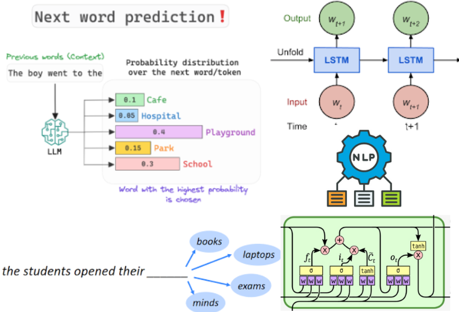
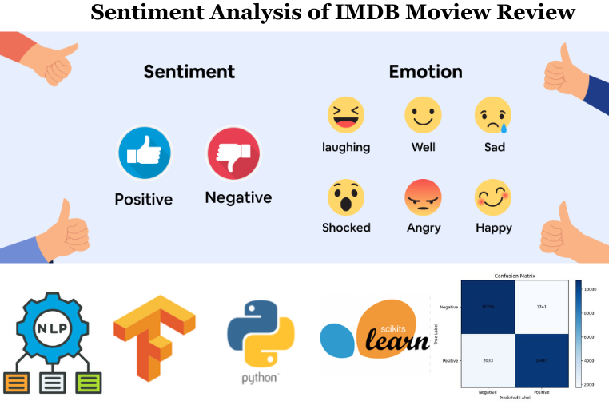
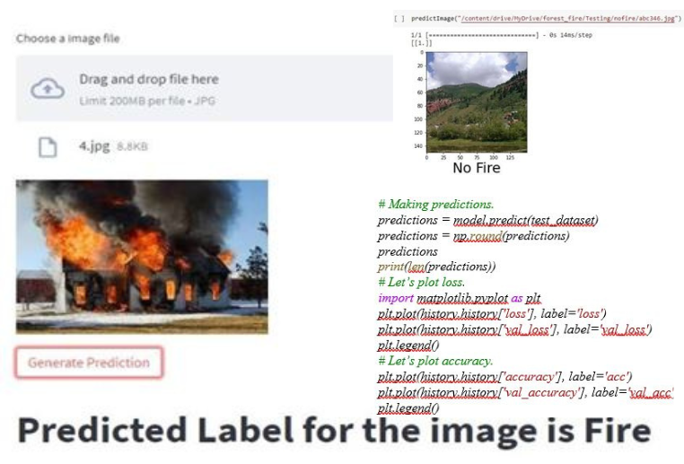
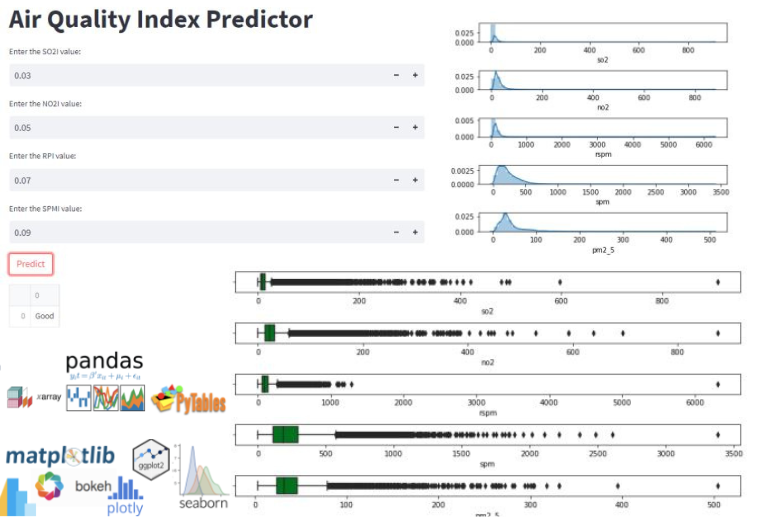
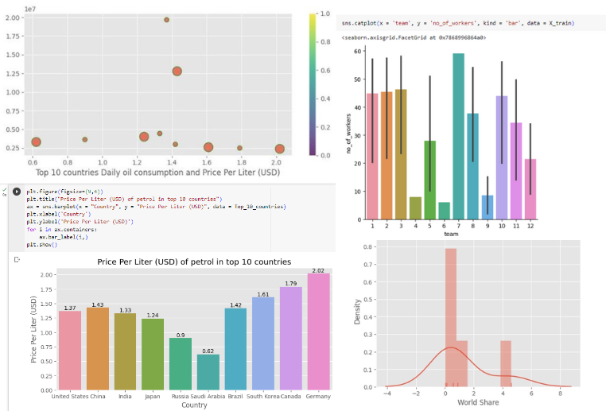
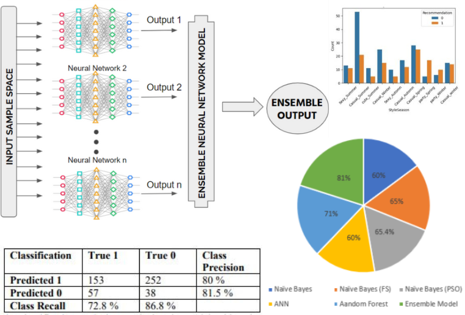

# Portfolio
---
## Natural Language Processing, Deep Learning, Computer Vision
 
My complete implementation of assignments and projects in [***Last Academic Year***](Summer, 2023).

**Next Word Prediction:** Next Word Prediction is a project that aims to develop a robust language model capable of
predicting the next word in a given text sequence. By utilizing deep learning techniques, specifically recurrent neural networks (RNNs) and Long Short-Term Memory (LSTM) networks, the project aims to learn patterns and relationships within a large corpus of text data. 

---
### Detect Positive and Negative moview review: Sentiment Analysis using LSTM and GRU

 The sentiment analysis system that takes a review as input and detect it either positive (1) or negative (0) using LSTM and GRU. I have used the IMDB movie review dataset for training the model. This dataset includes 25,000 movie reviews from IMDB, labelled by sentiment (positive/negative). Reviews have been preprocessed, and each review is encoded as a sequence of word indexes (integers). For convenience, words are indexed by overall frequency in the dataset, so that for instance the integer "3" encodes the 3rd most frequent word in the data. This allows for quick filtering operations such as: "only consider the top 20,000 most common words.

---
### Predict Forest Fire with CNN using TensorFLow, Keras, Python

In this project, I have detected the wildfire in the images and result is based on the accuracy that we get in the training and test part of the dataset. The input image has noise so the
preprocessing technique is used to eliminate the noise in this system and enhance the image quality

 

 

---
## Data Science

### Air Quality Index Predictor Web App
[***Model Implementation with web App:***]

[ ***Data Visualization:***]

  I performed comprehensive data wrangling, exploratory data analysis, data visualization to understand important variables, handled missing values, outliers, and performed feature engineering, and machine learning model to predict air quality index, I built an interactive user interface with Streamlit and hosted the web app on Heroku server.

 

 

---
### Petrol Gas Prices: Data Analysis and Visualization

I performed comprehensive EDA to understand important variables and the behaviour of different variables w.r.t others. 

 

 

---

### Improving Classification Performance In Dress Recommendation: A Stacking Ensemble Approach

For improving the classification performance in dress recommendation, I have combined the predictions from three base learners such as Random Forest, XGBoost, and an Artificial Neural Network (ANN) in the ensemble model. The stacking ensemble was examined on a different testing set after being trained on a specific training set. When compared to the individual models, the findings showed a considerable improvement in accuracy. After applying fold cross-validation, the accuracy of the stacking ensemble model increased to an impressive 81%. 

 

 

---

<h2 id="internship">Internship:</h2>
<ul>
<li>CODSOFT - Data Science</li>
 </ul>
 

<h2 id="skills">Skills/Tools:</h2>
<ul>
<li>AL, ML, DS, Data Analytics </li>
<li>Python (NumPy, Pandas, Matplotlib, Seaborn, Scikit-learn) working with Jupyter notebook and Google Colab</li>
<li>Chatbot Development</li>
<li>LangChain</li>
<li>API Integrationn</li>
<li>TensorFlow, PyTorch</li>
<li>ML, DL models </li>
<li>Katalon Studio (Testing)</li>
<li>Power BI</li>
 <li>C++</li>
<li>My SQL</li>
<li>MS Office, MS Visio</li>
 </ul>

Apart from technical skills, I possess strong Analytical, Problem-solving, Critical thinking, presentation skills and team-work abilities.

 

---

© 2023 Mahnoor Shoukat. Powered by Jekyll and the Minimal Theme.

